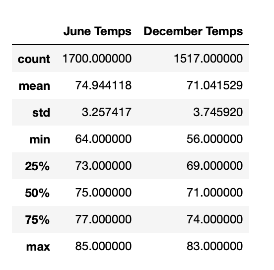
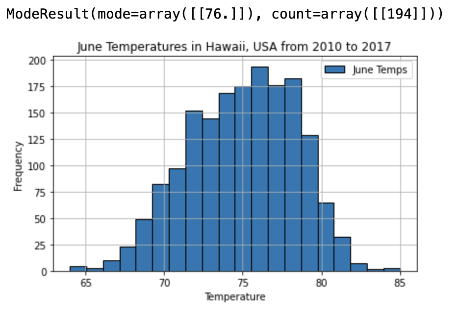
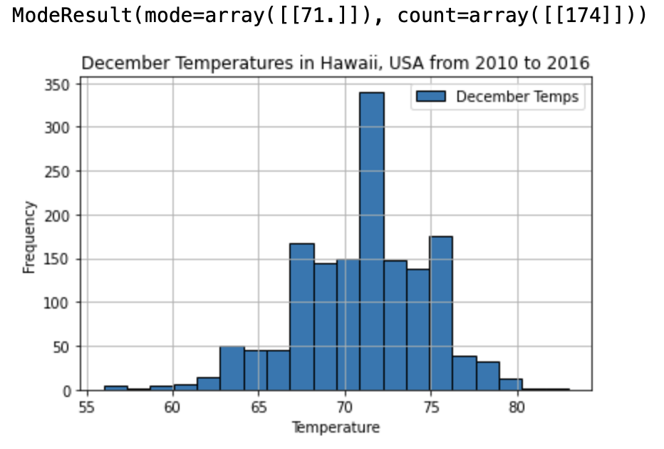
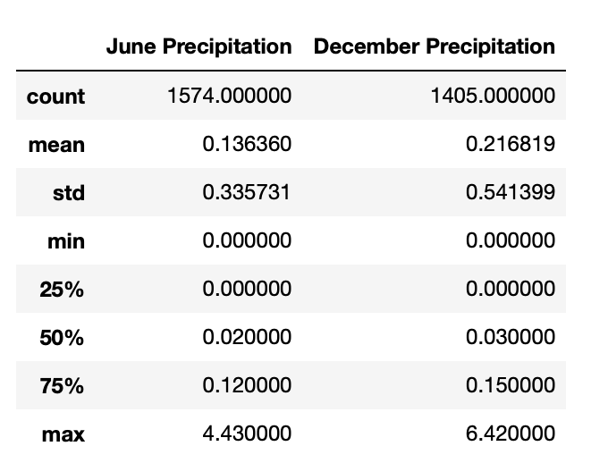

# Advanced Data Storage and Retrieval from SQLite Database

# Overview of the Analysis
<p>
The study analyzed daily weather data of Oauhu, Hawaii, USA from 2010 to 2017. Python was used to query an SQLite database for summary statistics of June and December temperature and precipitation readings. Results of the weather analytics will help potential investors determine the feasibility of opening a surf and shake shop on the island. 
</p>

# Results
<p align="center">
    <strong>Temperature Summary Statistics</strong> <br>
    
</p>

Key Weather Differences between June and December 
- The sample average daily temperature of Hawaii in June is much higher than that of December by almost 4 degrees Fahrenheit. The same pattern holds true for the sample median temperatures of June and December which are 75F and 71F respectively . 
- The temperature in June ranges from a minimum of 64F to a maximum of 85F. Meanwhile, the temperature in December ranges from 56F to 83F. 
- The mode or the most frequently recorded daily temperature reading in June from 2010 to 2017 was 76F. Meanwhile, 71F was the most frequently recorded temperature reading in December from 2010 to 2016. 

<p align="center">
  </img>
  </img>
</p>

# Summary

<p>
The temperature of Hawaii in both June and December are generally warm enough for surfing. This shows that the weather on the island should not be a hindrance for the proposed surf and shake shop. Relative to December, however, June has a higher sample average daily temperature. Further analysis below also shows that the sample average amount of precipitation received by the island in June is less than that of December. This implies that there will be slightly more favourable weather conditions for the business in June than Decemeber. 
</p>

<p>
Additional queries to gather more weather information can be made by accessing the precipitation column of the Measurement table of the database. Two separate queries could filter the daily precipitation readings for June and December then calculate summary statistics for it. 
</p>

```
# Query the June Precipitation, Put it into a DataFrame and Get summary statistics
results = session.query(Measurement.prcp).filter(extract('month',Measurement.date)==6).all()
june_prcp_list=list(np.ravel(results))
june_prcp_df=pd.DataFrame(june_prcp_list, columns=['June Precipitation'])
june_prcp_df.describe()

# Query the December Precipitation, Put it into a DataFrame and Get summary statistics
results = session.query(Measurement.prcp).filter(extract('month',Measurement.date)==12).all()
dec_prcp_list=list(np.ravel(results))
dec_prcp_df=pd.DataFrame(dec_prcp_list, columns=['December Precipitation'])
dec_prcp_df.describe()

# Merge Summary Statistics of June and December Precipitation 
prcp_summary_df = pd.merge(june_prcp_df.describe(), dec_prcp_df.describe(), left_index=True, right_index=True)
prcp_summary_df
```
<p align="center">
    <strong>Precipitation Summary Statistics</strong> <br>
    
</p>